# Silico

**AI-only company orchestrator** — autonomous CEO and Developer agents that collaborate to grow a $100 seed into a profitable digital business.

## What is Silico?

Silico is an experiment in fully autonomous business operations. Two AI agents (CEO and Developer) run as employees of a virtual company, making decisions, executing trades, building products, and communicating with each other — all without human intervention.

- **CEO Agent**: Strategy, finance, market research, task management
- **Developer Agent**: Build, deploy, trade execution, code management
- **Orchestrator**: Manages round-based execution, safety guardrails, state synchronization

## System Architecture



## Round Interaction Flow

Each round represents one simulated business day. The orchestrator calls the CEO first, then the Developer, executes their actions, and logs the results.



## Notion DB Schema

All inter-agent communication, task tracking, decision logging, and company state are stored in Notion databases.



## Project Structure

```
silico/
├── src/
│   ├── orchestrator/        # Main loop, round lifecycle, action execution
│   │   ├── index.ts         # Entry point
│   │   ├── round-manager.ts # Round lifecycle
│   │   ├── action-executor.ts
│   │   ├── state-manager.ts
│   │   └── validators.ts    # Trading & spending safety checks
│   ├── agents/
│   │   ├── base-agent.ts    # Shared agent logic
│   │   ├── ceo/             # CEO system prompt & context builder
│   │   └── developer/       # Developer system prompt & context builder
│   ├── mcp/                 # MCP service wrappers
│   │   ├── notion.ts        # Notion (messages, tasks, state, logs)
│   │   ├── exchange.ts      # Binance Futures API
│   │   ├── github.ts
│   │   ├── vercel.ts
│   │   ├── gmail.ts
│   │   └── calendar.ts
│   ├── types/               # TypeScript type definitions
│   └── utils/               # Logger, config
├── docs/                    # Architecture diagrams
├── logs/                    # Round logs (gitignored)
├── .env.example
├── package.json
└── tsconfig.json
```

## Getting Started

### Prerequisites

- Node.js 20+
- Notion integration with databases set up
- Binance Futures Testnet account
- Anthropic API key

### Setup

```bash
# Install dependencies
npm install

# Copy environment template and fill in your keys
cp .env.example .env

# Build
npm run build

# Run (development)
npm run dev

# Run (production)
npm start
```

## Safety Guardrails

| Rule | Limit |
|------|-------|
| Max single position | 30% of trading balance |
| Max total exposure | 70% of trading balance |
| Max leverage | 10x |
| Stop-loss | Mandatory, max 5% |
| Reward:risk ratio | Minimum 2:1 |
| Survival mode | Treasury < $10 blocks spending |
| Emergency stop | Treasury < $5 or 5 consecutive failures |

## License

MIT
